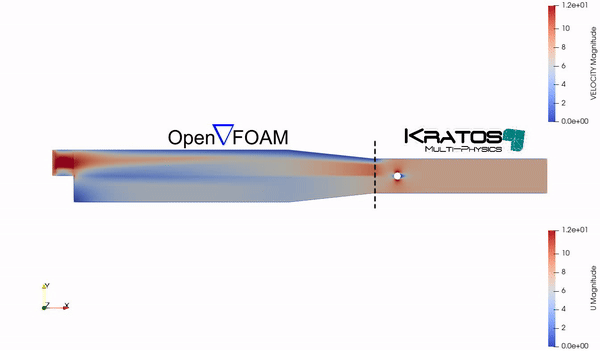

# OpenFOAM-Kratos Coupling Case

This folder contains an example of coupling OpenFOAM and Kratos using CoSimIO for data exchange. The OpenFOAM case simulates the flow over a backward-facing step, and the outlet velocities are used as inlet conditions for a Kratos simulation of flow past a cylinder.

## Files and Directories

- [OpenFoamCase/pitzDaily](../OpenFoamCase/pitzDaily): Contains the OpenFOAM case setup.
- [KratosCase/FlowPastACylinder.gid](../KratosCase/FlowPastACylinder.gid): Contains the Kratos case setup.
- `export_velocity_from_openfoam.py`: Script to run OpenFOAM, export velocity data, and communicate with Kratos via CoSimIO.
- `kratos_cosimio_receiver.py`: Script to run Kratos, import velocity data from OpenFOAM, and perform the coupled simulation.

<p align="center">
  
</p>

## Running the Example

### Step 1: Run the OpenFOAM Simulation

Open a terminal and run the `export_velocity_from_openfoam.py` script to simulate the flow in OpenFOAM and send the outlet velocity data to Kratos.

```bash
python3 export_velocity_from_openfoam.py
```

### Step 2: Run the Kratos Simulation
In another terminal, run the kratos_cosimio_receiver.py script to simulate the flow past a cylinder in Kratos using the data received from OpenFOAM.

```bash
python3 kratos_cosimio_receiver.py
```

## Key Parts of the Exchange and Communication in the Code
In the provided scripts, the critical operations for data exchange between OpenFOAM and Kratos using CoSimIO are outlined:

### OpenFOAM Script (openfoam_cosimio_sender.py):

CoSimIO Initialization and Connection:

```python
settings = CoSimIO.Info()
settings.SetString("my_name", "openfoam_cosimio_sender")
settings.SetString("connect_to", "kratos_cosimio_receiver")
settings.SetInt("echo_level", 1)
settings.SetString("solver_version", "1.25")
info = CoSimIO.Connect(settings)
```

#### Exporting Velocity Data:

```python
if os.path.exists(velocity_file):
    with open(velocity_file, 'r') as file:
        data = file.readlines()[1:]  # Skip the header
        velocities = []
        for line in data:
            values = line.split()
            velocities.extend([
                float(values[0]), float(values[1]), float(values[2]),  # Coordinates (x, y, z)
                float(values[3]), float(values[4]), float(values[5])   # Velocity components (Ux, Uy, Uz)
            ])
        # Prepare data to be exported
        export_info = CoSimIO.Info()
        export_info.SetString("identifier", identifier)
        export_info.SetString("connection_name", connection_name)
        data_to_export = CoSimIO.DoubleVector(velocities)
        # Export the data
        CoSimIO.ExportData(export_info, data_to_export)
```

### Kratos Script (kratos_cosimio_receiver.py):

#### Importing Velocity Data from OpenFOAM:

```python
import_info = CoSimIO.Info()
import_info.SetString("identifier", identifier)
import_info.SetString("connection_name", self.connection_name)
data_to_import = CoSimIO.DoubleVector()
return_info = CoSimIO.ImportData(import_info, data_to_import)
velocities = list(data_to_import)
num_points = len(velocities) // 6  # 3 for coordinates and 3 for velocity components
velocities = np.reshape(velocities, (num_points, 6))
```

#### Interpolation of Velocity Data:

```python
def interpolate_velocity(self, x, y, velocities):
    distances = []
    for vel in velocities:
        dist = np.sqrt((vel[0] - x) ** 2 + (vel[1] - y) ** 2)
        if dist == 0:
            return vel[3], vel[4]
        distances.append((1.0 / dist, vel))
    distances.sort(reverse=True, key=lambda pair: pair[0])
    closest = distances[:3]
    sum_weights = sum([pair[0] for pair in closest])
    normalized_weights = [pair[0] / sum_weights for pair in closest]
    U_x_interp = sum(w * vel[3] for w, (_, vel) in zip(normalized_weights, closest))
    U_y_interp = sum(w * vel[4] for w, (_, vel) in zip(normalized_weights, closest))
    return U_x_interp, U_y_interp
```

This explanation helps to highlight the key parts of the process for users, while still providing enough context to follow along.

## Synchronizing Data Exchange with Acknowledgment
In this coupling tutorial, we ensure synchronization between the OpenFOAM and Kratos solvers by using acknowledgment mechanisms. After exporting the velocity data, the openfoam_cosimio_sender.py waits for acknowledgment from the Kratos script before proceeding to the next time step. Similarly, Kratos sends an acknowledgment back to OpenFOAM after it receives and processes the data.

Below are the key code snippets demonstrating this acknowledgment process:

### OpenFOAM Script (openfoam_cosimio_sender.py):

```python
# Wait for acknowledgment from the importing script
identifier = f"acknowledge_timestep_{str(end_time).replace('.', '_')}"
ack_info = CoSimIO.Info()
ack_info.SetString("identifier", identifier)
ack_info.SetString("connection_name", connection_name)
ack_data = CoSimIO.DoubleVector()
CoSimIO.ImportData(ack_info, ack_data)
```

### Kratos Script (kratos_cosimio_receiver.py):

```python
# Acknowledge receipt of data
identifier = f"acknowledge_timestep_{str(self.time_step_cosimio).replace('.', '_')}"
ack_info = CoSimIO.Info()
ack_info.SetString("identifier", identifier)
ack_info.SetString("connection_name", self.connection_name)
ack_data = CoSimIO.DoubleVector([1.0])  # Dummy data to send as acknowledgment
CoSimIO.ExportData(ack_info, ack_data)
```

By incorporating this process, both solvers remain in sync throughout the simulation, ensuring that data is consistently and reliably exchanged between OpenFOAM and Kratos.

### Note on OpenFOAM Integration
To the best of my knowledge, OpenFOAM does not provide a straightforward Python interface for controlling each time step's  directly. As a workaround, this example restarts the simulation at each time step, utilizing OpenFOAM's built-in functions to output the desired data. The data exchange itself is completely handled by CoSimIO.

Here is an example code snippet from the export_velocity_from_openfoam.py script:

```python
# Loop over each time step
while end_time <= final_time:
    # Run blockMesh (only once at the start)
    if start_time == 0:
        block_mesh = BasicRunner(argv=["blockMesh", "-case", case_dir], silent=False)
        block_mesh.start()

    # Run the solver (e.g., simpleFoam)
    simple_foam = BasicRunner(argv=["foamRun", "-solver", "incompressibleFluid", "-case", case_dir], silent=False)
    simple_foam.start()

    # Read the velocity data from postProcessing
    post_process_dir = os.path.join(case_dir, "postProcessing", "outletVelocity", f"{end_time}")
    velocity_file = os.path.join(post_process_dir, "outlet.xy")

    # ... (rest of the data export and communication with CoSimIO)
```

## Visualization of Results
You can visualize the OpenFOAM results using ParaView by running paraFoam in the [OpenFoamCase/pitzDaily](../OpenFoamCase/pitzDaily) directory.

For Kratos, the results can be visualized using the provided output paths in the vtk_output directory within the [KratosCase/FlowPastACylinder.gid](../KratosCase/FlowPastACylinder.gid) folder.

## Requirements
- [OpenFOAM Installation Guide](https://openfoam.org/download/11-ubuntu/) v11
- [KratosMultiphysics Installation Guide](https://github.com/KratosMultiphysics/Kratos/blob/master/INSTALL.md)
- [CoSimIO Installation Guide](https://kratosmultiphysics.github.io/CoSimIO/tutorials/python/integration_co_sim_io.html)
- [PyFoam](https://pypi.org/project/PyFoam/)

