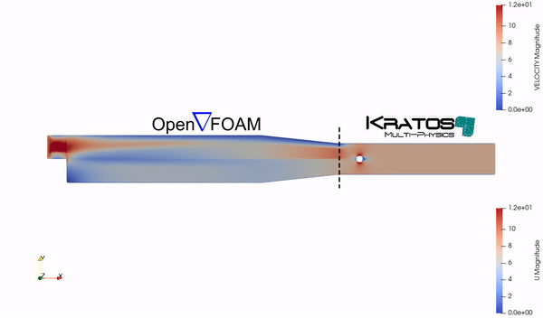

# CoSimIO Solver and Script Coupling

This repository provides examples of coupling different solvers and scripts using CoSimIO, a framework for solver-to-solver communication. It includes installation guides, tutorials, and example cases to help users integrate CoSimIO into their computational workflows for multi-solver simulations.

This repository is based on the official [CoSimIO tutorial](https://kratosmultiphysics.github.io/CoSimIO/) provided by Kratos Multiphysics. Most of the files differ from the original examples to meet our specific needs, particularly in coupling CoSimIO with another solver. This repository is designed to walk you through the basics, step by step, until you reach the point of coupling two different solvers: Kratos Multiphysics with OpenFOAM. This advanced coupling scenario is not covered in the original repository. For a more detailed exploration of CoSimIO and its capabilities, we encourage you to visit the official documentation and tutorials.

     

## Table of Contents

1. [Installation of CoSimIO](./Installation/README.md)

   This section provides a detailed guide on how to install CoSimIO on your system. It covers the necessary prerequisites and steps for setting up CoSimIO.
   
2. [Tutorial for CoSimIO (Python without solvers)](./CoSimIO_Script_Tutorials)

   Learn the basics of CoSimIO using simple Python scripts without involving any complex solvers. This tutorial is perfect for getting started with CoSimIO’s API and understanding its data exchange capabilities.

3. [Tutorial for Integrating Kratos with CoSimIO](./CoSimIO_Kratos_BasicTutorials)

   This section demonstrates how to integrate Kratos Multiphysics with CoSimIO for basic simulation tasks. It includes examples of setting up CoSimIO within a Kratos environment.

4. [Simulation Data Exchange with Kratos using CoSimIO](./CoSimIO_Kratos_SimulationDataExchange)

   This example illustrates how to perform simulation data exchange using CoSimIO in a Kratos Multiphysics environment.
   

     
   

   
6. [Simulation Data Exchange with OpenFOAM using CoSimIO](./CoSimIO_OpenFOAM_SimulationDataExchange)

   Learn how to exchange simulation data between OpenFOAM and CoSimIO. This section shows how to utilize CoSimIO for data communication in OpenFOAM simulations.

   

     
   

   
11. [Tutorial for Coupling Kratos with OpenFOAM](./CoSimIO_Kratos_OpenFOAM_Coupling)

    A detailed tutorial on coupling Kratos Multiphysics with OpenFOAM using CoSimIO. It covers the setup, execution, and data exchange processes in a coupled simulation environment.

    

     
   

